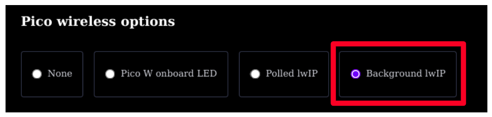

## 1 Reunindo o Setup Inicial

### 1.1 Pegando o arquivo de configuração
Antes de começar o código em si de escaneamento, precisamos instalar as dependências do nosso projeto, que incluem a lib responsável por habilitar o chip Wi-Fi do Pico W: `cyw43_arch`.

Isso pode ser feito de 2 formas: 

<details>
  <summary>1) Colocando Manualmente</summary>
  
  > Para adicionar a dependência manualmente, basta adicionar a seguinte linha no campo `target_link_libraries` do arquivo `CMakeLists.txt`:

```cmake
target_link_libraries(wifi-test
        pico_stdlib
        pico_cyw43_arch_lwip_threadsafe_background
        )

```
E também importar o arquivo `lwipopts.h` no diretório raiz. Pegue ele [aqui](https://github.com/goertzenator/lwip/blob/master/contrib-1.4.0/ports/old/v2pro/lwipopts.h)
</details>

<details>
  <summary>2) Instalando pela extensão do Pico W</summary>

> Caso você esteja criando o projeto utilizando a extensão do [Rasbperry Pi Pico](https://marketplace.visualstudio.com/items/?itemName=raspberry-pi.raspberry-pi-pico), podemos fazer isso com alguns cliques:


Após selecionar para criar um novo projeto utilizando a extensão, você verá a opção de adicionar a importação do `lwIP`:

<p align="center">
    
</p>


Esse comando já irá adicionar o pacote `lwIP` ao seu projeto, juntamente com a biblioteca `cyw43_arch`. Além disso, já colocará o arquivo `lwipopts.h` no diretório raiz.
  
</details>

---

O `lwipopts.h` é um arquivo que contém as configurações padrão do lwIP (Lightweight IP), que é uma pilha de protocolos TCP/IP de código aberto, projetada especificamente para sistemas embarcados. Veja mais [aqui](https://www.nongnu.org/lwip/2_1_x/group__tcp__raw.html)


### 1.2 Pegando o IP da máquina
Como estamos enviando a requisição para um servidor local, precisamos saber o endereço IP do servidor (nosso PC). Para isso, abra o terminal e digite o seguinte comando:

- **Linux**: `hostname -I` 
- **Windows**: `ipconfig`

Isso vai retornar seu endereço IP (v4). Geralmente, é o primeiro que aparece na listagem (192.x.x.x)
### 1.3 Pegando informações do Wi-Fi
Para concectar a placa no Wi-Fi, precisamos saber o SSID (nome da rede) e a senha. **Então, tenha isso em mãos.**

### 1.4 Configurando o CMakeLists
No Cmake vamos precisar apenas adicionar uma linha em `target_link_libraries`:

```c
target_link_libraries(wifi-test
        pico_stdlib
        pico_cyw43_arch_lwip_threadsafe_background
        )

```
Explicação da sigla:
- `pico_cyw43_arch` → É a **arquitetura** que integra o **chip CYW43** (Wi-Fi + LED) no ambiente do **Raspberry Pi Pico**
    > No Pico W, o LED integrado é controlado pelo Wi-Fi
- `lwip` → Significa que ele está usando a **pilha de rede lwIP** (Lightweight IP)
- `threadsafe` → Significa que é **seguro para usar com múltiplas "threads" ou núcleos** (quando roda coisas em paralelo ou callbacks)
- `background` → A rede é cuidada em **background**, ou seja, **você não precisa chamar nada no `main loop`**

A Lib cyw43 tem outros modos que você pode ver [aqui](https://www.raspberrypi.com/documentation/pico-sdk/networking.html#group_pico_cyw43_arch), como o "modo manual" e o "modo LED" (não carrega a pilha TCP/IP e habilita só o controle do LED)

---
- ### Próximo: [Configuração do Servidor](../2-configuracao-servidor/configurando-servidor.md)